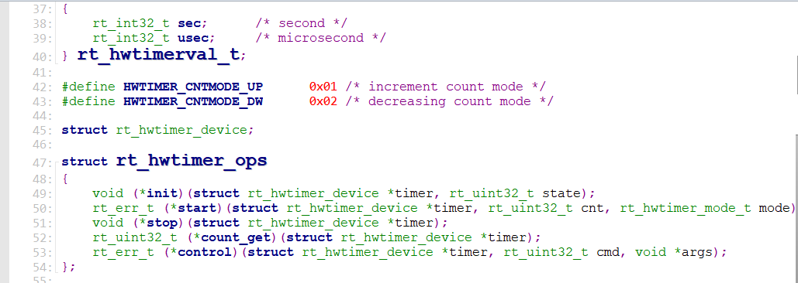
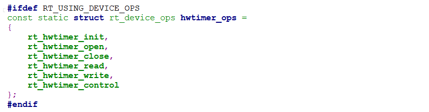
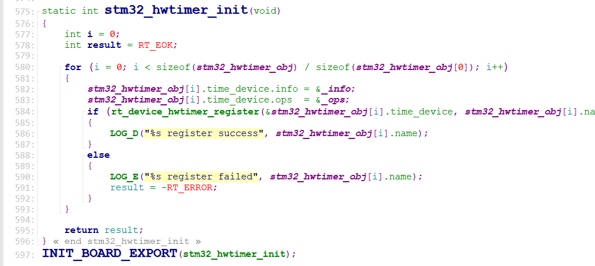
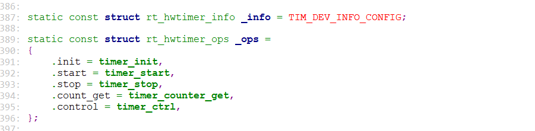

## 说明
RT-Thread提供HWTIMER设备管理接口来管理硬件定时器，接口文件位于`rt-thread-master\rt-thread\components\drivers\hwtimer`目录下，该文件的核心函数为`rt_device_hwtimer_register()`，在定时器初始化时调用。在该底层驱动文件中，同样定义了定时器的操作方法，方便在硬件驱动文件中实现各个方法。

## 流程说明
RT-Thread还提供了硬件驱动文件`drv_hwtimer.c`，用于实现HWTIMER设备底层驱动中定义的方法。在使用硬件驱动文件之前，项目工程要先添加HWTIMER的HAL库或其他底层驱动库文件。程序首先调用`stm32_hwtimer_init()`函数对HWTIMER进行初始化。

然后上面说的硬件驱动文件中实现底层驱动操作方法，在硬件驱动文件中定义了对应的回调函数。

最终利用上图中的各个函数实现对HWTIMER的初始化、启动、设置等操作。

> timer_init()函数实际上是调用HAL_TIM_Base_Init()进行初始化，在HAL_TIM_Base_Init()中要调用HAL_TIM_Base_MspInit()函数初始化IO口、CLK、NVIC，该函数默认是一个虚函数(WEAK修饰)，如果没有实现要自行定义。